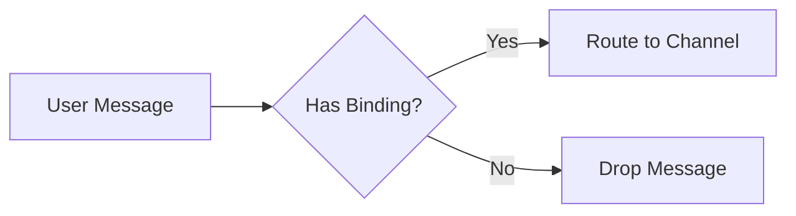

# Writing Documentation Articles

Sloppy docs live in `docs/`, built with VitePress, and target **regular users** — not developers of Sloppy itself. Write to help someone set up, configure, and use the product.

## Before Writing

1. Read `docs/.vitepress/config.ts` to understand the current sidebar structure and section grouping.
2. Read 1–2 existing articles from the same sidebar section to match tone and depth.
3. Identify which `sloppy.json` config keys are relevant — read the actual config model in `Sources/` if needed.

## Language

All articles must be written in **English only**.

## File Setup

Every article needs YAML frontmatter:

```markdown
---
layout: doc
title: Short Page Title
---
```

After creating or moving a file, update the sidebar in `docs/.vitepress/config.ts` — add the new entry to the correct section and position.

## Structure Template

```markdown
---
layout: doc
title: Feature Name
---

# Feature Name

One-paragraph overview: what this feature is and why a user would care.

## How it works

Plain-language explanation of the core concept. Avoid internal module names
and implementation details. Focus on what the user experiences.

## Setup / Getting started

Step-by-step instructions with numbered steps. Include config snippets
and Dashboard UI paths where applicable.

## Configuration

Show the relevant slice of `sloppy.json` with a table explaining each field.

## Related

- [Link to related article](/section/slug)
```

Not every section is required — adapt to the topic. Short articles (like setup guides) may skip "How it works" if the intro covers it.

## Writing Style

### Tone
- Second person: "you", "your" — address the reader directly.
- Present tense: "Sloppy stores memory locally" not "Sloppy will store".
- Conversational but precise. Explain *what* and *why*, not *how the code works internally*.

### What to avoid
- Internal module names (`CoreRouter`, `ChannelRuntime`, `SQLiteStore`) unless essential for the reader.
- Implementation details (actor isolation, Swift protocols, internal data structures).
- Jargon without explanation — if a term is necessary, define it on first use.
- Walls of text — break long explanations into short paragraphs (2–4 sentences).

### What to include
- Practical examples: real `sloppy.json` snippets, curl commands, Dashboard paths.
- Tables for reference data (config fields, command lists, comparison).
- ASCII flow diagrams when showing how data moves through the system.
- Mermaid diagrams (VitePress supports them) for more complex flows or architectures.

## Config Snippets

Show only the **relevant slice** of `sloppy.json`, not the entire file. Accompany every snippet with a field table:

```markdown
### Provider settings (`memory.provider`)

| Setting | Default | What it controls |
|---|---|---|
| `mode` | `local` | Where semantic indexing happens: `local`, `http`, or `mcp` |
| `endpoint` | — | URL of the external HTTP memory service |
```

Use `—` for fields with no default. Show realistic values in JSON examples, not placeholder `"..."`.

## Diagrams

### ASCII diagrams

Use for simple linear flows (message routing, request lifecycle):

```
User (Telegram)
      │
      ▼
  Gateway Plugin
      │
      ▼
  Channel Runtime ── processes message
      │
      ▼
  Agent Response
```

Use box-drawing characters (`│`, `▼`, `──`, `─`) for clean rendering.

### Mermaid diagrams

Use for branching logic, state machines, or architecture overviews:

````markdown

````

Keep diagrams focused — no more than 8–10 nodes. If it needs more, split into multiple diagrams or simplify.

## Cross-Links

Link to related pages when referencing a concept covered elsewhere:

```markdown
See [About Channels](/channels/about) for details on bindings and access control.
```

Add a `## Related` section at the bottom for broader connections. Use relative VitePress links (no `.md` extension, no domain).

## VitePress Containers

Use sparingly for important callouts:

```markdown
::: tip
Short helpful tip.
:::

::: warning
Something the user should be careful about.
:::

::: danger
Something that can cause data loss or breaking changes.
:::
```

## Sidebar Registration

After creating a new article, add it to `docs/.vitepress/config.ts` in the correct sidebar group:

```typescript
{
  text: "Section Name",
  items: [
    // ... existing items
    { text: "Your New Page", link: "/section/your-new-page" }
  ]
}
```

## Checklist

Before finishing an article:

- [ ] Frontmatter has `layout: doc` and `title`
- [ ] Written entirely in English
- [ ] Opens with a clear one-paragraph summary
- [ ] Config snippets show only relevant fields with a reference table
- [ ] No internal module names unless necessary for the reader
- [ ] Cross-links added where related topics exist
- [ ] Sidebar updated in `docs/.vitepress/config.ts`
- [ ] `npm run build` passes in `Dashboard/` (if VitePress config changed)
