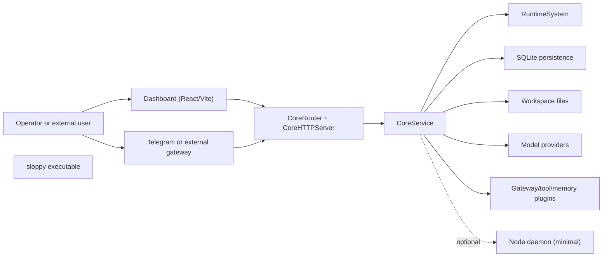
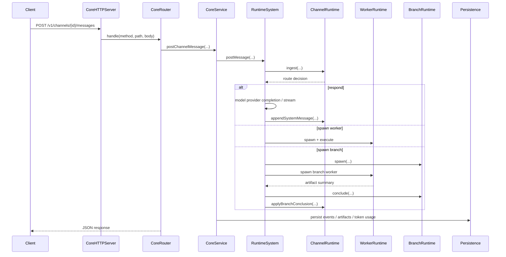

# Project Design

## Status

This document describes the current implemented architecture of Sloppy as of March 2026. It is intentionally grounded in the repository structure and code paths that exist today, not only in product intent or long term roadmap notes.

## Purpose

Sloppy is a local-first control plane for observable AI workflows. The system is designed to keep agent execution inspectable by turning work into typed runtime entities, persisted events, and operator-facing APIs instead of a single opaque prompt loop.

At a high level the project combines:

- a Swift runtime and API server (`sloppy`)
- an actor-based orchestration kernel (`AgentRuntime`)
- shared wire and domain contracts (`Protocols`)
- extension points for providers, tools, memory, and gateways (`PluginSDK`)
- a minimal process daemon target (`Node`)
- a React/Vite operator dashboard (`Dashboard`)

## Design Goals

- Keep agent behavior structured through explicit runtime entities: channel, branch, worker, compactor, visor, agent session.
- Preserve observability through typed events, persisted artifacts, memory bulletins, and dashboard-friendly APIs.
- Support local development with minimal infrastructure: one process, one SQLite database, one workspace directory.
- Isolate responsibilities between transport, orchestration, persistence, and integration boundaries.
- Make extension points explicit so model providers, tools, memory backends, and channel gateways can change independently.
- Prefer Swift Concurrency and actor isolation over ad hoc shared mutable state.

## Non-Goals

- A fully distributed scheduler or multi-node execution fabric. The repository has early `Node` groundwork, but the main runtime is still single-core-process oriented.
- A production desktop application. `App` is currently a placeholder target.
- Autonomous tool freedom without policy. Tool execution is intentionally mediated by agent policy and guardrails.

## System Context

## Architectural Principles

### 1. Explicit runtime model before autonomy

User input is first mapped onto runtime entities and state transitions. Routing is policy-driven and inspectable. The runtime decides whether to answer inline, spawn a branch, or spawn a worker before any deeper execution flow continues.

### 2. One control plane, multiple persistence forms

Sloppy deliberately uses both SQLite and filesystem storage:

- SQLite stores canonical event, artifact, project, plugin, token, bulletin, and memory records.
- workspace files store agent catalogs, session transcripts, skills manifests, system logs, and other operator-editable state.

This split keeps the event and query path fast while allowing editable file-backed configuration and agent state.

### 3. Actor isolation at the orchestration layer

The runtime kernel is composed of Swift actors (`RuntimeSystem`, `ChannelRuntime`, `WorkerRuntime`, `BranchRuntime`, `Compactor`, `Visor`, `EventBus`). This limits accidental shared-state coupling and matches the asynchronous nature of agent execution.

### 4. Operator visibility is a first-class requirement

The API surface, event envelopes, memory bulletins, and dashboard sections are product features, not debug-only internals. Runtime state is designed to be inspectable at every layer.

## Module Topology

| Module | Responsibility | Notes |
| --- | --- | --- |
| `Sources/Protocols` | Shared DTOs and runtime contracts | API payloads, event envelopes, memory and runtime models |
| `Sources/PluginSDK` | Extension protocols | Model, tool, memory, and gateway plugin interfaces |
| `Sources/AgentRuntime` | Orchestration kernel | Channel, branch, worker, compactor, visor, event bus |
| `Sources/sloppy` | Main backend and control plane | Config, HTTP transport, routing, service layer, persistence, plugin bootstrap |
| `Sources/ChannelPluginTelegram` | In-process Telegram gateway | Bundled gateway implementation |
| `Sources/Node` | Minimal process daemon | Current groundwork, not main scheduling path |
| `Sources/App` | Placeholder app target | Logs a placeholder message only |
| `Dashboard/` | Operator UI | Runtime overview, projects, actors, agents, config, logs |

## Boot Sequence

The `sloppy` executable is the real system entrypoint today.

1. `CoreMain` resolves config from CLI, environment overrides, or workspace defaults.
2. It creates the workspace directory tree if needed.
3. It bootstraps logging and ensures `sloppy.json` exists.
4. It constructs `CoreService`, `CoreRouter`, and `CoreHTTPServer`.
5. `CoreService` builds model providers, persistence, memory, orchestration helpers, and delivery services.
6. Gateway plugins are bootstrapped.
7. Optional server start, optional demo request, and optional immediate visor bulletin run.
8. In foreground mode the process becomes the long-running control plane.

### Workspace Layout

The workspace is prepared under the configured root with these directories:

- `agents/`
- `actors/`
- `sessions/`
- `artifacts/`
- `memory/`
- `logs/`
- `plugins/`
- `tmp/`

This gives the project a stable local operational boundary without requiring an external service mesh.

## Runtime Kernel

`RuntimeSystem` is the orchestration facade. It owns the runtime actors and exposes the main control-plane actions.

### sloppy actors

| Runtime actor | Responsibility |
| --- | --- |
| `ChannelRuntime` | Ingests messages, tracks channel history, estimates context pressure, decides route |
| `WorkerRuntime` | Creates workers, executes them, routes interactive input, stores worker artifacts in memory |
| `BranchRuntime` | Creates focused branch contexts, recalls memory, extracts TODOs, validates conclusions |
| `Compactor` | Schedules summary workers when context utilization crosses thresholds |
| `Visor` | Produces runtime bulletins and links them back into memory |
| `EventBus` | Broadcasts typed event envelopes to subscribers and buffers when no listeners exist |

### Runtime routing model

`ChannelRuntime` applies a lightweight deterministic policy:

- high context utilization triggers branching
- worker-intent keywords trigger interactive worker execution
- analysis-oriented keywords trigger branching
- everything else falls back to inline response

This means routing is cheap, inspectable, and stable, but it is also intentionally simple. It is a practical v1 policy rather than a learned planner.

### End-to-end message flow

## Agent Sessions

In addition to raw channel flows, the project has a richer agent-session subsystem that powers agent chat, tools, skills, and cron features in the dashboard.

### Why this layer exists

The lower-level runtime is generic and event-oriented. The agent-session layer adds:

- per-agent configuration and selected model management
- prompt composition and bootstrap context
- persistent message/event transcripts
- attachment handling
- streamed assistant updates over SSE
- tool invocation and policy enforcement during a session run

### Main pieces

| Component | Responsibility |
| --- | --- |
| `AgentSessionOrchestrator` | Session creation, prompt/run orchestration, streamed response assembly |
| `AgentSessionFileStore` | File-backed session transcript storage |
| `AgentCatalogFileStore` | Agent definitions and config files |
| `AgentSkillsFileStore` | Installed skills manifest per agent |
| `ToolExecutionService` | Concrete tool backend for read/write/edit/exec/process/session/memory operations |
| `ToolAuthorizationService` | Tool policy evaluation |
| `SessionProcessRegistry` | Tracks long-lived per-session subprocesses |

### Session execution model

When a user posts a session message:

1. the orchestrator ensures the session context exists
2. agent config determines the active model and capabilities
3. user message and attachments are persisted as session events
4. the message is projected into a synthetic runtime channel
5. `RuntimeSystem.postMessage` handles routing and response generation
6. streamed chunks are reflected back into the session transcript
7. the dashboard consumes updates through `/v1/agents/{agentId}/sessions/{sessionId}/stream`

This design reuses the runtime kernel while still giving agents a richer operator experience than raw channels.

## API and Transport Design

### Transport

- HTTP server: SwiftNIO HTTP/1.1
- request handling: `CoreHTTPServer`
- routing: `CoreRouter`
- service boundary: `CoreService`
- streaming: Server-Sent Events for live session updates

The transport layer is intentionally thin. `CoreHTTPServer` only converts HTTP requests into router calls and writes normal JSON or SSE responses.

### Route organization

The router groups endpoints by feature family:

- health and runtime basics
- channels, channel events, workers, artifacts, bulletins
- runtime config and logs
- providers
- projects and tasks
- actors board and actor routing
- agents, agent config, sessions, tools, skills, token usage, cron
- channel plugin management

This keeps HTTP concerns centralized while pushing business logic into `CoreService`.

## Persistence Design

Sloppy uses a layered persistence model instead of forcing every kind of state into a single storage abstraction.

### SQLite responsibilities

The schema currently includes tables for:

- `channels`
- `tasks`
- `events`
- `artifacts`
- `memory_bulletins`
- `memory_entries`
- `memory_edges`
- `memory_provider_outbox`
- `memory_recall_log`
- `token_usage`
- `dashboard_projects`
- `dashboard_project_channels`
- `dashboard_project_tasks`
- `channel_plugins`

This is the canonical query surface for runtime history, artifacts, memory graph data, project data, plugin registry, and token accounting.

### File-backed responsibilities

Filesystem-backed stores are used for:

- agent catalog and config
- agent sessions and transcripts
- installed skill manifests
- actor board snapshots
- channel-session mappings
- system logs

This choice keeps operator-managed objects human-readable and easy to sync or inspect outside the API.

### Memory architecture

The default memory implementation is `HybridMemoryStore`.

It combines:

- canonical SQLite records for memory entries and edges
- optional external memory provider indexing
- weighted retrieval that merges semantic, keyword, and graph signals
- an outbox table for retryable provider synchronization
- retention-aware expiration behavior

This is a practical middle path between local durability and pluggable semantic recall.

## Event Model

All runtime activity is normalized into typed envelopes (`EventEnvelope`) with a protocol version, identifiers, timestamps, entity references, payload, and extensions.

Important message types include:

- `channel.message.received`
- `channel.route.decided`
- `branch.spawned`
- `branch.conclusion`
- `worker.spawned`
- `worker.progress`
- `worker.completed`
- `worker.failed`
- `compactor.threshold.hit`
- `compactor.summary.applied`
- `visor.bulletin.generated`

This event model is the backbone for persistence, recovery, observability, and future protocol compatibility.

## Reliability and Recovery

### Recovery

`RecoveryManager` rehydrates the runtime from persisted channels, tasks, events, and artifacts. Recovery is replay-oriented: runtime state is reconstructed from durable records instead of being treated as the source of truth itself.

### Event buffering

`EventBus` buffers recent events when no live subscribers are attached, which avoids dropping activity during short observer gaps.

### Compactor retries

`Compactor` deduplicates queued jobs per channel and applies bounded retry with backoff. This prevents repeated threshold storms from creating uncontrolled summary churn.

### Workspace fallback

If the configured workspace cannot be created, `CoreMain` falls back to `/tmp/sloppy/<workspace-name>`. The system prefers degraded availability over hard startup failure.

## Integration and Extension Model

### Model providers

`PluginSDK` defines `ModelProviderPlugin`. `CoreModelProviderFactory` resolves configured models and can bridge into `AnyLanguageModel`, including OpenAI and Ollama-oriented flows.

### Gateway plugins

Two gateway patterns exist:

- in-process `GatewayPlugin` implementations linked directly into `sloppy`
- out-of-process HTTP plugins registered through `/v1/plugins`

The bundled Telegram plugin uses the in-process path. External plugins use the channel plugin protocol defined in `docs/specs/channel-plugin-protocol.md`.

### Tool execution

Tooling is deliberately split into:

- policy layer: what an agent may do
- execution layer: how the action actually runs

Current built-in capabilities include file access, file edits, command execution, subprocess management, session utilities, channel history, memory operations, and cron-related actions. Unsupported adapter placeholders such as `web.search` and `web.fetch` already exist in the surface and can be filled later.

## Dashboard Design

The dashboard is a React/Vite operator console rather than a generic component library.

### UI sections

The current top-level sections are:

- Overview
- Projects
- Actors
- Agents
- Config
- Logs

### Frontend architecture

- app shell: `App.tsx`
- route state: `src/app/routing`
- API adapter: `src/shared/api/coreApi.ts`
- feature-oriented views under `src/features` and `src/views`
- thin dependency container in `src/app/di/createDependencies.ts`

The frontend remains intentionally simple: local route state, direct API calls, and feature-focused views over a centralized runtime model.

## Security and Trust Boundaries

The system is not designed as a zero-trust distributed platform yet, but several boundaries are already explicit:

- tool execution is filtered through agent tool policy and guardrails
- file reads/writes resolve against allowed roots
- exec operations enforce deny-listed command prefixes and execution roots
- external plugins are separated by HTTP boundaries
- Telegram ingress can be restricted by user and chat allowlists

The current design assumes a trusted operator environment more than a hostile multi-tenant platform.

## Current Limitations

These are important design realities, not defects in this document:

- routing is mostly heuristic and keyword-driven
- `Node` is minimal and not yet a true distributed worker plane
- `App` is a placeholder target
- state is intentionally split across SQLite and files, which improves operability but increases coordination complexity
- outbound HTTP plugin delivery logs failures but has limited automatic retry behavior
- session orchestration is richer than base channel routing, which means the project currently carries two related but not identical abstractions

## Why this design is coherent

The architecture is opinionated but internally consistent:

- transport is thin
- orchestration is actor-based
- persistence is replay-friendly
- observability is built into the protocol
- extension points are explicit
- local-first development remains easy

That combination is the main design idea of Sloppy: give operators a visible control plane for AI work without needing to start with a large distributed platform.
