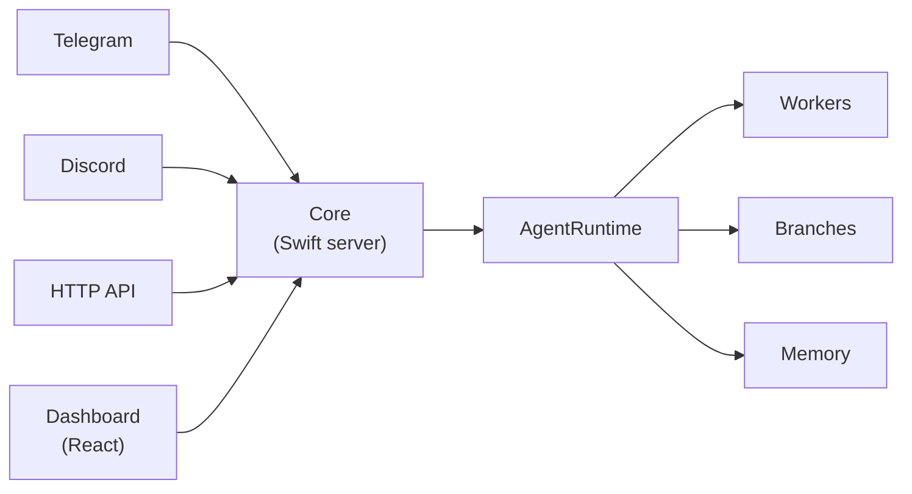

# Sloppy

Local-first control plane for observable AI workflows.

Sloppy is a self-hosted runtime you run on your own machine or server. It becomes the coordination layer between your AI agents, your conversation channels, and your tools — keeping every step inspectable, persisted, and under your control.

Who is it for? Developers and teams who want AI agents they can observe, extend, and trust — without giving up their data or relying on a hosted black box.

## What is Sloppy?

Sloppy combines a Swift HTTP server and actor-based orchestration kernel with a React operator dashboard. You deploy a single `sloppy` process; it handles everything from message ingestion to model calls, background task execution, memory maintenance, and event emission.

Channels (Telegram, Discord, HTTP API) deliver messages to the runtime. The runtime decides how to respond — inline, via a spawned worker, or through a focused branch — and keeps a complete typed record of every decision. The dashboard lets you watch it all happen in real time.

## What makes it different?

- **Local-first**: runs on your hardware, your rules, your data stays put
- **Actor-isolated concurrency**: channels, workers, branches, and memory each run in isolation — no shared mutable state
- **Observable by design**: every action becomes a typed runtime entity and a persisted event you can inspect or replay
- **Multi-channel**: one process serves Telegram, Discord, and the HTTP API simultaneously
- **Plugin-extensible**: add model providers, tools, memory backends, and gateway channels via `PluginSDK`
- **Open source**: MIT licensed

## How it works



Core is the single entry point. All traffic — from channels, the CLI, or the dashboard — flows through it. The `AgentRuntime` owns scheduling and supervision; everything downstream is handled internally.

## Key capabilities

### Multi-channel gateway

A single Sloppy instance handles Telegram, Discord, and HTTP API channels concurrently. Each channel is an isolated runtime context with its own message history and context tracking.

### Agent runtime

The orchestration kernel decides how to process each message: respond inline, spawn a background worker for long-running tasks, or fork a branch for focused sub-task execution. Workers and branches run in actor isolation.

### Memory and compaction

Sloppy maintains persistent memory across sessions. When a channel's context window approaches capacity, the compactor automatically summarizes history and stores the result in memory — keeping the agent effective without manual intervention.

### Visor supervision

Visor runs continuously in the background, monitoring worker health, detecting timeout conditions, maintaining memory freshness, and publishing status bulletins so agents always have current system context. See [Visor overview](/visor/overview).

### Web dashboard

The React operator dashboard shows live channel activity, agent state, memory, workers, and configuration. It connects directly to the Core API.

### Plugin system

Model providers (OpenAI, Anthropic, Gemini, Ollama), tools, memory backends, and gateway channels are all loaded via the `PluginSDK` plugin contracts — no core changes required.

## Quick start

### Prerequisites

| Dependency | Notes |
| --- | --- |
| Swift 6 toolchain | macOS 14+ or Linux |
| `sqlite3` | Runtime dependency |
| Node.js + npm | For Dashboard |

On Ubuntu/Debian, install SQLite headers first:

```bash
sudo apt-get update && sudo apt-get install -y libsqlite3-dev
```

### Install and run

```bash
git clone https://github.com/TeamSloppy/Sloppy.git
cd Sloppy
bash scripts/install.sh
```

This builds the server stack and the Dashboard bundle, then installs `sloppy` into `~/.local/bin`. Verify the installation:

```bash
sloppy --version
```

Then start the server with `sloppy run`. From another terminal, check it with `sloppy status`.

If you prefer a curl installer flow:

```bash
curl -fsSL https://sloppy.team/install.sh | bash
```

For the full setup guide see [Install](/install). For Docker see [Build With Docker](/guides/build-with-docker).

## Dashboard

After the server starts, open the operator dashboard in your browser:

- Local default: `http://localhost:25102`

The dashboard shows channels, agent activity, memory, and configuration in real time. For the design system reference see [Dashboard Style](/dashboard-style).

## Configuration (optional)

API keys go in a `.env` file at the repository root:

```bash
OPENAI_API_KEY=your_key
GEMINI_API_KEY=your_key
ANTHROPIC_API_KEY=your_key
```

Runtime configuration lives in `sloppy.json`. If you do nothing, Sloppy uses sensible defaults and picks up any API keys from the environment.

See [Model Providers](/guides/models) for provider-specific setup and [CLI Reference](/guides/cli) for all runtime commands.

## Start here

| Guide | Description |
| --- | --- |
| [Install](/install) | Get Sloppy running from the terminal or with Docker |
| [CLI Reference](/guides/cli) | All `sloppy` subcommands and flags |
| [Model Providers](/guides/models) | Configure OpenAI, Gemini, Anthropic, and Ollama |
| [Channels](/channels/about) | How channels work and how to set up Telegram and Discord |
| [Agents](/agents/runtime) | Runtime internals: workers, branches, and scheduling |
| [Visor](/visor/overview) | Supervision, health monitoring, and system bulletins |

## Learn more

| Resource | Description |
| --- | --- |
| [Project Design](/architecture/project-design) | Full architecture: modules, runtime flows, persistence, and design goals |
| [API Reference](/api/reference) | HTTP endpoints grouped by resource with parameters and responses |
| [Specifications](/specs/channel-plugin-protocol) | Channel plugin protocol and runtime PRD |
| [Plugins](/guides/plugins) | How to build and load plugins via PluginSDK |
